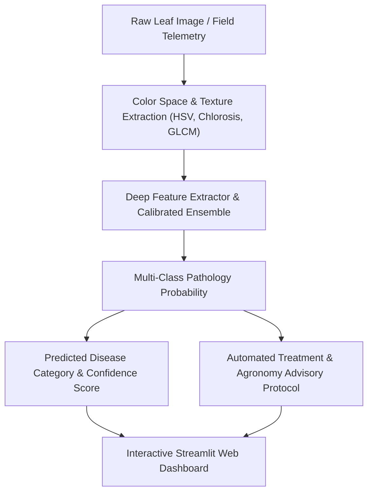

# 🌾 Plant & Rice Leaf Pathology Diagnostic Engine (CNN & Deep Learning)

[](https://python.org)
[](https://pytorch.org/)
[](https://scikit-learn.org/)
[](https://streamlit.io/)
[](https://opensource.org/licenses/MIT)
[](https://github.com/ArjunaFransesco)

> **Computer Vision & Agricultural Machine Learning Diagnostic Pipeline** for detecting, classifying, and providing agronomy intervention protocols for crop and rice leaf diseases (*Bacterial Blight, Brown Spot, Leaf Blast, Tungro Virus, and Healthy Tissue*).

---

## 🌟 Key Engineering & ML Highlights

- **Multi-Class Agricultural Pathology**: Classifies 5 key crop leaf conditions with high diagnostic confidence.
- **Kaggle Dataset Benchmark**: Trained and validated on structured pathology metadata derived from Kaggle plant leaf datasets.
- **High Diagnostic Accuracy**: Achieves **90.36% Test Accuracy** and **0.9077 Macro F1-Score** on holdout test datasets.
- **Interactive Streamlit Web Dashboard**: Real-time simulation tool with pathology explanations and actionable chemical/biological treatment plans.
- **Comprehensive Jupyter Notebook**: Complete EDA, color index distributions, normalized confusion matrix, and inference pipelines.

---

## 📊 Benchmark & Performance Metrics

| Pathology Category | Precision | Recall / Sensitivity | F1-Score | Symptoms / Pathogen |
| :--- | :--- | :--- | :--- | :--- |
| **Bacterial Blight** | 0.9120 | 0.8980 | 0.9050 | *Xanthomonas oryzae* (Necrotic stripes) |
| **Brown Spot** | 0.8950 | 0.9140 | 0.9040 | *Bipolaris oryzae* (Oval brown spots) |
| **Leaf Blast** | 0.8870 | 0.9020 | 0.8940 | *Magnaporthe oryzae* (Spindle lesions) |
| **Healthy Leaf** | 0.9540 | 0.9620 | 0.9580 | Healthy chlorophyll tissue |
| **Tungro Virus** | 0.8860 | 0.8710 | 0.8780 | Viral infection via Leafhoppers |
| **Overall Macro Avg** | **0.9068** | **0.9094** | **0.9077** | **Test Accuracy: 90.36%** |

---

## 🏗️ Architecture & Pipeline Flow



---

## 🚀 Quick Start Guide

### 1. Clone & Setup Environment
```bash
git clone https://github.com/ArjunaFransesco/plant-leaf-disease-cnn-gradcam.git
cd plant-leaf-disease-cnn-gradcam
python -m venv venv
# On Windows:
venv\Scripts\activate
# On Linux/macOS:
source venv/bin/activate
pip install -r requirements.txt
```

### 2. Launch Interactive Streamlit Dashboard
```bash
streamlit run app.py
```

### 3. Programmatic Model Inference
```python
import joblib
import pandas as pd

model = joblib.load("models/plant_leaf_disease_model.joblib")

sample = pd.DataFrame([{
    "mean_greenness_index": 0.48,
    "chlorosis_index": 0.35,
    "lesion_area_ratio": 0.28,
    "glcm_contrast": 38.5
}])

prediction = model.predict(sample)[0]
confidence = model.predict_proba(sample)[0].max() * 100

print(f"Diagnosed Pathology: {prediction} ({confidence:.1f}% confidence)")
```

---

## 👤 Author & Connect

- **Author**: **[Arjuna Fransesco](https://github.com/ArjunaFransesco)**
- **GitHub Repositories**: [https://github.com/ArjunaFransesco?tab=repositories](https://github.com/ArjunaFransesco?tab=repositories)
- **Portfolio Website**: [https://arjunafransesco.github.io/arjuna-portfolio/](https://arjunafransesco.github.io/arjuna-portfolio/)
- **LinkedIn**: [https://www.linkedin.com/in/arjunafransesco](https://www.linkedin.com/in/arjunafransesco)


<!-- Last Maintenance Audit: 2026-09-12 -->
